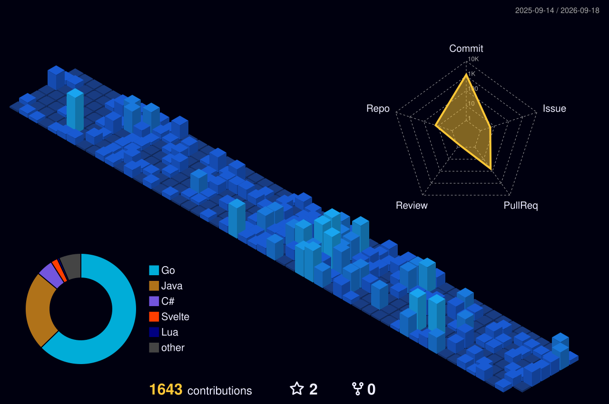

# Hi there / Olá / Hallöchen! 👋

  

---

### 🇺🇸 About Me

I am a **Software Engineering student** and an aspiring **Backend Developer**. My core focus lies in **Python** and **Go**, while I am currently expanding my horizons with **Java** and planning to dive into **TypeScript** soon.

- 🛠️ **Environment:** Pop!_OS Linux 24.04 + LazyVim (Neovim)
- 🔭 **Current Focus:** Developing robust CRUD systems and academic projects.
- ⚡ **Fun fact:** I can do all things through Christ, who strengthens me.

---

### 🇧🇷 Sobre Mim

Sou graduando em **Engenharia de Software** e desenvolvedor **Backend** em formação. Tenho foco principal em **Python** e **Go**, explorando atualmente o ecossistema **Java** e, futuramente, **TypeScript**.

- 🛠️ **Setup:** Pop!_OS Linux 24.04 + LazyVim (Neovim)
- 🔭 **No momento:** Focado em projetos CRUD de alta performance e desafios acadêmicos.
- ⚡ **Curiosidade:** Tudo posso Naquele que me fortalece.

---

### 🇩🇪 Über mich

Ich bin **Software Engineering Student** und angehender **Backend-Entwickler**. Mein Schwerpunkt liegt auf **Python** und **Go**, wobei ich gerade meine Kenntnisse in **Java** vertiefe und für die Zukunft **TypeScript** plane.

- 🛠️ **Umgebung:** Pop!_OS Linux 24.04 + LazyVim (Neovim)
- 🔭 **Fokus:** Entwicklung von CRUD-Systemen und Uni-Projekten.
- ⚡ **Fun Fact:** Ich vermag alles durch den, der mich mächtig macht, Christus.

---

### 🛠️ Tech Stack & Werkzeuge

#### 💻 Languages (Linguagens) (Programmiersprachen)

#### 🗄️ Infrastructure & Databases (Infraestrutura e Base de Dados) (Infrastruktur & Datenbanken)

#### 🔧 Setup & OS

[]

---

### 🤝 Connect / Contato / Kontakt

  

